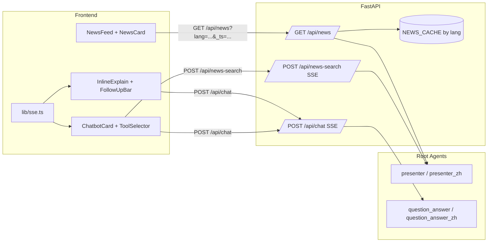

# News Feed Project — Unified Plan (Business + Technical)

This file merges `PLAN1.md` and `PLAN.md` into one current-state view.
Verified against repository code and scripts on February 26, 2026.

---

## 1) Business Requirements

### 1.1 Product Summary

Build a bilingual (EN/ZH) news feed app with AI help built into the reading flow:
- Users read structured news cards.
- Users click any card for inline AI explanation.
- Users ask inline follow-up questions.
- Users use a chatbot card for normal chat, internet search, and topic news search.

### 1.2 User Experience (Current Behavior)

- **News cards**
  - Fields: title, summary, image (or fallback), source, published date.
  - Grouped by category; Chinese mode shows translated category/content.
- **Explain This**
  - One-click inline explanation under the selected card.
  - Scroll anchoring keeps the clicked card visually stable while expanding.
- **Follow-up**
  - Follow-up input appears under inline explanation.
  - Follow-up answer streams in the same block.
- **Chatbot card at bottom**
  - Normal chat.
  - Internet search mode.
  - Topic search mode (news by keyword).
- **Global streaming rule**
  - Only one stream runs at a time across explain, follow-up, and chatbot.
  - Inputs/buttons are disabled while streaming.
- **Shared conversation context**
  - Explain, follow-up, and chatbot share one global history array.
  - Language toggle resets session state (history, expanded card, pending follow-up, stream state).

### 1.3 Scope Delivered

- FastAPI backend endpoints:
  - `GET /api/news`
  - `POST /api/chat` (SSE)
  - `POST /api/news-search` (SSE)
- Next.js frontend:
  - feed, cards, inline explain, follow-up, chatbot card, tool selector, streaming UI.
- EN/ZH language mode across feed and chat.
- Local prewarm scripts + cron installer.
- AWS phased deployment scripts (A/B/C/D).

---

## 2) Technical Details

### 2.1 Runtime Architecture (Local)

- Frontend: Next.js App Router (`frontend/`).
- Backend: FastAPI (`backend/main.py`).
- Root Python agent modules used by backend:
  - `presenter.py`, `presenter_zh.py` (news/tool flows)
  - `question_answer.py`, `question_answer_zh.py` (Q&A/tool flows)
- `router.py` is legacy/reference only and is not called by `backend/main.py`.

### 2.2 API Contract (Actual)

| Endpoint | Method | Body / Query | Behavior |
|---|---|---|---|
| `/` | GET | - | Health check: `{"status":"ok"}` |
| `/api/news` | GET | `lang=en\|zh`, optional `refresh=true` | Returns structured categories/articles. Uses per-lang in-memory cache. `refresh=true` forces blocking refresh and cache overwrite. Sends no-store headers. |
| `/api/chat` | POST (SSE) | `{ message, history, lang }` | Routes by language to QA module. Streams `{"delta":"..."}` then `[DONE]` (or `{"error":"..."}`). |
| `/api/news-search` | POST (SSE) | `{ query, history, lang }` | Rewrites to `"./ {query}"`, routes by language to presenter module, streams markdown deltas. |

Validation at request boundary (Pydantic):
- `message`: 1..4000 chars (trimmed)
- `query`: 1..200 chars (trimmed)
- `history`: max 40 turns
- each history turn `content`: 1..4000 chars (trimmed)
- each history turn `role`: `user|assistant`
- extra fields forbidden

### 2.3 Frontend Execution Details

- Shared top-level state lives in `frontend/app/page.tsx`: `lang`, `history`, `isStreaming`, `expandedArticleIndex`, `followUpMessage`.
- News loading uses:
  - `GET /api/news?lang=${lang}&_ts=${Date.now()}`
  - `fetch(..., { cache: "no-store" })`
- Inline explain sends:
  - `Tell me more about this article: {title}. URL: {url}`
  - endpoint: `/api/chat`
- Chatbot modes:
  - default chat -> `/api/chat`
  - internet search -> `/api/chat` with `Search the web: ...`
  - topic search -> `/api/news-search`
- SSE parser (`frontend/lib/sse.ts`) reads `data:` lines, appends `delta`, handles `[DONE]`, and surfaces backend `error`.

### 2.4 Caching and Prewarm

- Backend cache is in-memory, keyed by `lang`.
- On `/api/news`:
  - cache hit -> immediate return + background refresh (if idle),
  - cache miss -> blocking fetch + store.
- Local prewarm script:
  - `scripts/prewarm_cache.sh`
  - calls `/api/news?lang=en&refresh=true` and `/api/news?lang=zh&refresh=true`
- Local cron installer:
  - `scripts/install_cron.sh` adds daily 7:00 host cron.

### 2.5 Local Configuration and Run

- Next.js config (`frontend/next.config.ts`):
  - local mode (`NEXT_STATIC_EXPORT != 1`): rewrite `/api/:path*` -> `http://localhost:8000/api/:path*`
  - static export mode (`NEXT_STATIC_EXPORT=1`): `output: "export"`, images unoptimized
  - `experimental.proxyTimeout = 120000`
- Local run:
  - backend: `uvicorn main:app --app-dir backend --port 8000`
  - frontend: `cd frontend && npm run dev`

### 2.6 AWS Mapping and Deployment Flow

| Local Piece | AWS Translation |
|---|---|
| FastAPI backend container | ECR image + App Runner service |
| Next frontend app | Static export (`NEXT_STATIC_EXPORT=1`) to S3 |
| Local Next `/api` rewrite | CloudFront `api/*` behavior to App Runner |
| Local prewarm cron | Lambda + EventBridge schedule |
| Local operational checks | CloudWatch alarms (Phase C scripts) |

AWS request path:
1. User opens CloudFront domain.
2. Non-API paths -> S3 origin (frontend static assets).
3. `/api/*` paths -> App Runner backend.
4. Backend serves `/api/news`, `/api/chat`, `/api/news-search`.
5. App Runner CORS is aligned to CloudFront domain by script.

Scripted deployment phases:
- **Phase A (`scripts/aws_phase_a/`)**: backend build, push, deploy/update App Runner.
- **Phase B (`scripts/aws_phase_b/`)**: build frontend export, publish to S3, create/fix CloudFront `api/*`, update backend CORS.
- **Phase C (`scripts/aws_phase_c/`)**: prewarm Lambda, schedule, alarms.
- **Phase D (`scripts/aws_phase_d/`)**: private S3 + CloudFront OAC hardening.

`dockerPrep.bash` points to these phased scripts.

### 2.7 Current Risk and Recommended Fix

Known issue:
- Intermittent HTTP 422 can occur when frontend sends oversized payloads to `/api/chat` (history/message limits enforced by backend).

Recommended fix:
1. Trim outgoing history to latest 40 turns before `/api/chat`.
2. Trim outgoing message and cap to 4000 chars.
3. Optional hardening: cap stored app history to latest 40 turns at write time.

### 2.8 Core Dependencies

- Backend: `fastapi`, `uvicorn`, `sse-starlette`, `openai`, `python-dotenv`, `requests`, `aiohttp`, `beautifulsoup4`, `pydantic>=2.11`
- Frontend: Next.js 16, React 19, Tailwind 4, `react-markdown`, `remark-gfm`, `@tailwindcss/typography`

