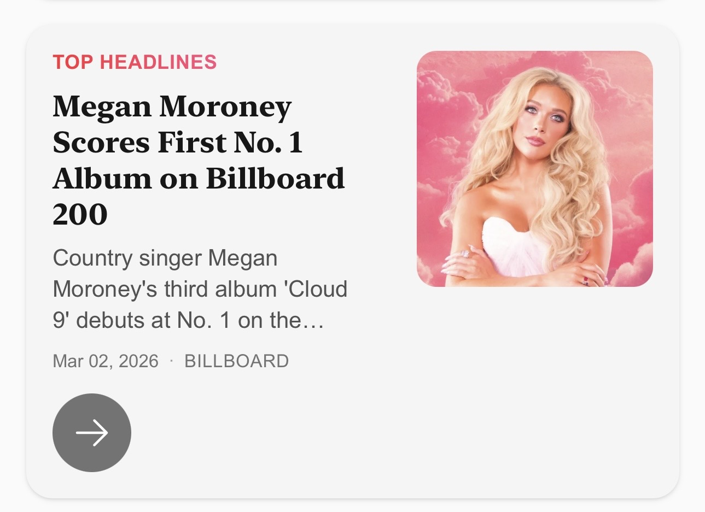

# News Summarizer Agent

  

## The Problem I had

Somewhere along the way, I became "the AI guy." 
Mention world events? I'd pivot to OpenAI. 
Mention business? I'd bring up startups. 
Mention anything remotely technical? Now we're talking.

But when hanging out with non-tech friends, family members, or strangers? This is slightly embarrassing. 
I realized I didn't actually know what was going on in the broader world.

## What I wanted

So I opened news apps. I scrolled social media. I tried to broaden my knowledge. 
Yet I ran into the same pain point every time. 

Reading a full article takes 5–10 minutes, and half of that is fighting ads, cookie banners, and autoplay videos. 
Social media was faster but worse — everything felt like outrage bait or deliberately one-sided. 
I didn't come away feeling informed. I came away feeling exhausted.

What I actually wanted was simple: 
Tell me what happened today, why it matters, and let me move on. 
Two minutes. Neutral. No noise.

I couldn't find that. 
So I built it.

---

## Architecture

  

## What It Does

Every day, this agent reads news across six categories — Top Headlines, Business, Technology, AI, Canada, and China — and turns them into clean news cards, each with a short briefing. Just the essentials. 
If something catches your eye, you can click the "Explain This" button.

The agent will then: 
- read the original article 
- search for additional context 
- return with a sourced explanation of what happened, why it matters, and how it connects to the bigger picture 
- The agent is also prompted to lean slightly optimistic. 

It's not just summarizing, it's doing the legwork you don't have time for. 
Everything links back to the original source. You can always go deeper if you want. 
But you don't have to.

---

## Try It Here:
No setup required. It is already deployed to AWS.

**Live:** https://dvabg4443rdrf.cloudfront.net/

---

## Tech Stack

- **Backend:** FastAPI (Python)
- **Frontend:** Next.js
- **LLM:** OpenAI GPT models
- **News sources:** NewsAPI, Brave Search
- **Deployment:** AWS App Runner + CloudFront + S3

---
