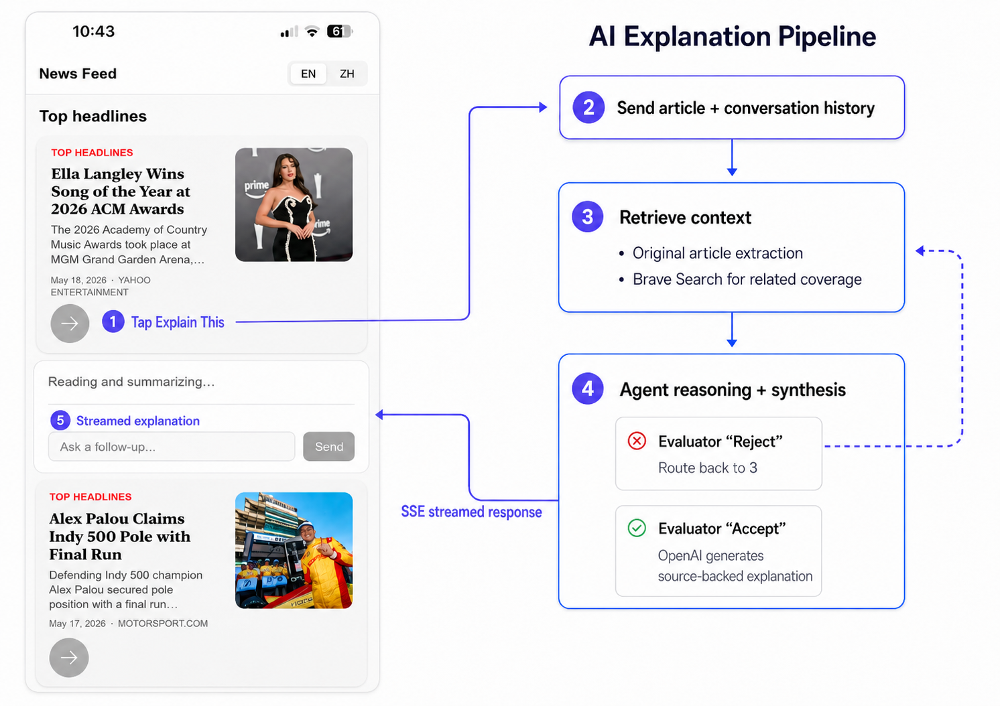
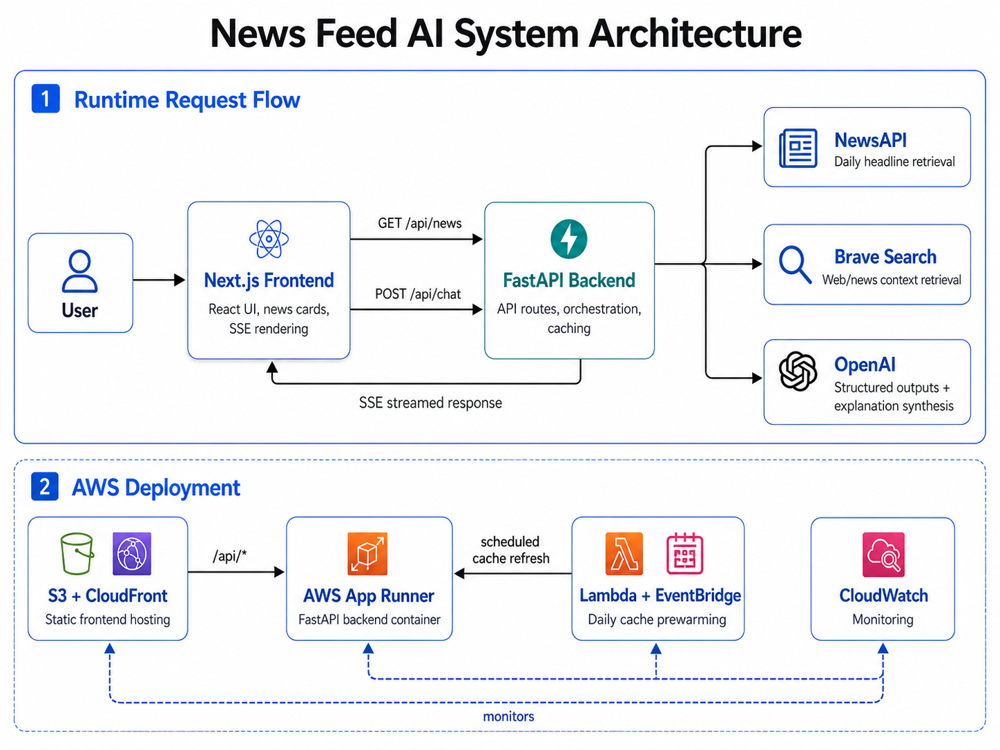

# News Feed AI

An AI news briefing app that turns noisy daily headlines into clean, neutral news cards, then streams source-backed explanations when something deserves a deeper look.

**Live demo:** https://dvabg4443rdrf.cloudfront.net/

**Built with:** FastAPI, Next.js, OpenAI, NewsAPI, Brave Search, Server-Sent Events, AWS App Runner, S3, CloudFront, Lambda, and EventBridge.

## Demo Flow



---

## Why I Built This

The problem: traditional news apps take too long to get through, while social media often feels polarizing, emotionally manipulative, and optimized for engagement instead of understanding.

What I wanted was simple:

> Tell me what happened today, why it matters, and let me move on.

So I built a news agent that reads the headlines, turns them into concise cards, and lets me ask for deeper context only when I care.

---

## What It Does

News Feed AI gives users a clean daily briefing across six categories, including Top Headlines, Business, and more.

Each article becomes a short card with a readable title, a brief summary, the source, the publish date, and a link to the original article.

When a user clicks **Explain This**, the app does more than summarize the article. It retrieves the original source when possible, searches for additional context, and streams back an explanation of what happened, why it matters, and how it connects to the bigger picture.

- **Two-minute daily briefing:** turns messy headlines into concise news cards designed for fast understanding.
- **Grounded answers:** explanations combine article extraction, Brave Search, and cited sources.
- **Production deployment:** frontend is served from S3 and CloudFront, while the FastAPI backend runs on AWS App Runner.

---

## How It Works

The core flow is:

1. The backend fetches raw headlines from NewsAPI across the configured categories.
2. OpenAI converts the raw news payload into strict structured JSON for the card UI.
3. The frontend renders the cards in a minimal Next.js interface.
4. When a user clicks **Explain This**, the frontend sends the article and conversation history to the FastAPI backend.
5. The QA agent decides whether to read the article directly or search the web for broader context.
6. The answer is streamed back over SSE and rendered incrementally in the UI.
7. Sources are listed as clickable Markdown links so the user can verify or continue reading.

This makes the app feel lightweight on the surface, while the backend does the heavier retrieval, evaluation, and synthesis work behind the scenes.

---

## Architecture



The production deployment uses a static frontend and API backend split:

- **Frontend:** Next.js static export hosted on S3 and served through CloudFront.
- **Backend:** FastAPI service containerized and deployed to AWS App Runner.
- **Routing:** CloudFront routes `/api/*` requests to the App Runner backend.
- **Prewarming:** Lambda and EventBridge refresh the daily news cache so users do not always pay the cold-start cost.
- **Monitoring:** CloudWatch alarms are configured for the prewarm Lambda and App Runner service.

## Local Development

### 1. Clone and configure environment variables

Create a `.env` file in the project root:

```bash
OPENAI_API_KEY=your_openai_api_key
NEWS_API_KEY=your_newsapi_key
BRAVE_API_KEY=your_brave_api_key
CORS_ORIGINS=http://localhost:3000,http://127.0.0.1:3000
```

### 2. Run the backend

```bash
pip install -r backend/requirements.txt
uvicorn main:app --app-dir backend --host 0.0.0.0 --port 8000
```

The backend will be available at:

```text
http://localhost:8000
```

### 3. Run the frontend

```bash
cd frontend
npm install
npm run dev
```

The frontend will be available at:

```text
http://localhost:3000
```

---

## API Overview

```text
GET  /api/news
```

Returns the daily structured news cards. Supports language selection and refresh behavior.

```text
POST /api/chat
```

Streams an AI explanation or follow-up answer over SSE.

```text
POST /api/news-search
```

Searches for news around a user-provided topic.

---

## Testing

The repo includes tests for the highest-risk parts of the system:

- backend QA orchestration and tool routing
- paywall-aware evaluator behavior
- structured news card generation
- cache hit and refresh logic
- frontend SSE parsing

Backend tests:

```bash
pytest Tests/backend -q
```

Frontend SSE tests:

```bash
npx vitest run --config Tests/frontend/vitest.config.ts
```

---

## What I Learned

This project started as a simple personal problem, but it became a much deeper exercise in building useful AI software:

- designing prompts that produce consistent structured data
- grounding answers in live retrieval instead of model memory
- streaming long-running model responses into a responsive UI
- deploying a split frontend/backend app on AWS
- using scheduled prewarming to improve perceived performance

The main lesson was that good AI apps are not just a model call. The product quality comes from everything around the model: retrieval, structured outputs, evaluation, caching, streaming, UI design, and deployment.

---

## Future Improvements

- Add topic sections for countries, people, and entertainment news.
- Move the chatbot into a full-screen drawer for a cleaner mobile experience.
- Add richer personalization while preserving the neutral briefing style.

---

## Status

The app is deployed and usable today:

**https://dvabg4443rdrf.cloudfront.net/**
